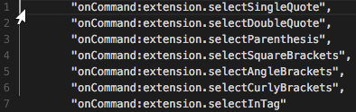
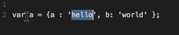
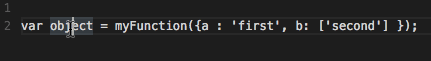

# vscode-quick-select


Yes I know about the ⌃⇧⌘← and ⌃⇧⌘→ expand/shrink selection. Having come from VIM I think these are still missing.
It currently only supports matching on a single line, but does support multiple cursors.
See the examples below.


## Installation

Press <kbd>F1</kbd> and narrow down the list commands by typing `extension`. Pick `Extensions: Install Extension`.
Select the `Quick and Simple Text Selection` extension from the list


## Manual Install

**Mac & Linux**
```sh
cd $HOME/.vscode/extensions
```
**Windows**
```sh
cd %USERPROFILE%\.vscode\extensions
```

**All Platforms**
```
git clone https://github.com/dbankier/vscode-quick-select.git
cd vscode-quick-select
npm install
~~~


## Usage

Here some examples - and it supports multiple selections.

## <kbd>⌘</kbd><kbd>k</kbd> <kbd>"</kbd>


## <kbd>⌘</kbd><kbd>k</kbd> <kbd>'</kbd>


## <kbd>⌘</kbd><kbd>k</kbd> <kbd>(</kbd>
## <kbd>⌘</kbd><kbd>k</kbd> <kbd>[</kbd>
## <kbd>⌘</kbd><kbd>k</kbd> <kbd>{</kbd>



## <kbd>⌘</kbd><kbd>k</kbd> <kbd><</kbd>
This also selects the matching tag.
## <kbd>⌘</kbd><kbd>k</kbd> <kbd>></kbd>
This matches the tag value.


### Customisation

~~~
extension.selectSingleQuote
extension.selectDoubleQuote
extension.selectParenthesis
extension.selectSquareBrackets
extension.selectAngleBrackets
extension.selectCurlyBrackets
extension.selectInTag
~~~

## License

MIT © [David Bankier @dbankier](https://github.com/dbankier)
[@davidbankier](https://twitter.com/davidbankier)